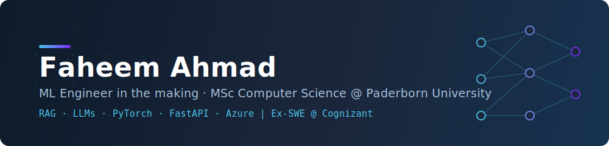

# Hi, I'm Faheem Ahmad 👋

**CS Master's student at Paderborn University · Ex-Software Engineer @ Cognizant · Building at the intersection of ML and backend engineering**

I spent three years as a Software Engineer at Cognizant maintaining and modernizing enterprise .NET applications on Azure - building CI/CD pipelines, ETL workflows, and systems serving 10,000+ users. Now I'm pursuing my Master's in Computer Science in Germany, focused on machine learning: from RAG pipelines and LLMs to graph neural networks and explainable AI.

- 🔭 Currently working on the **ARAG Data Pipeline** - a modular Retrieval-Augmented Generation system with hybrid retrieval (semantic + keyword search) that grounds LLM outputs in verifiable sources to reduce hallucination and enable source attribution
- 🌱 Deepening my knowledge in **NLP, knowledge graphs, and MLOps**
- 💼 Open to **working student roles and internships** in ML/software engineering
- ✍️ I write and create educational tech content at [TechiesTalk](https://techiestalk.in) and on [YouTube](https://www.youtube.com/c/TechiesTalk)
- 📫 Reach me at **faheemahmad.de@gmail.com**

---

## 🛠️ Tech Stack

**AI / ML**

**Backend & Frameworks**

**Data, Cloud & MLOps**

---

## 🚀 Featured Projects

| Project | Description | Tech |
|---------|-------------|------|
| **ARAG Data Pipeline** 🚧 *in progress* | Modular RAG pipeline with hybrid retrieval (semantic + keyword), structured context augmentation, and grounded generation - improving factual consistency and source attribution over standalone LLMs | Python, RAG, Hybrid Retrieval, LLMs |
| **Harvest Helper** | AI-powered crop advisor: Gradient Boosting recommender (99.7% top-3 accuracy) + RAG pipeline with LLaMA 3.3 70B over FAISS, fused with real-time weather and Sentinel-2 satellite data | FastAPI, RAG, LLaMA, FAISS |
| **Explainable GNN on Knowledge Graphs** | R-GCN for node classification on the AIFB knowledge graph (91.7% accuracy) with interpretability analysis of model decisions | PyTorch Geometric, R-GCN, RDFLib |
| **TapShip** | e-Mandi platform connecting farmers directly to buyers - awarded a VTU innovation grant in agricultural technology | PHP, MySQL, JavaScript |
| **Drowsiness Detection Device** | Real-time driver drowsiness detection via eye-blink tracking with automated IoT SMS alerts | OpenCV, Computer Vision, IoT |

---

## 📊 GitHub Stats

  
  

---

## 🤝 Connect with me

